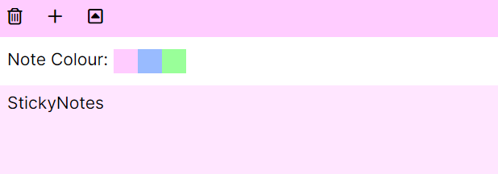
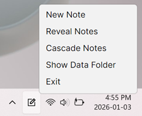

# StickyNotes
A bare bones sticky note implementation written in .NET Core.

### Features
* Ability to create, delete, colour, and re-arrange sticky notes.
* Notes are alt-tabbable.
* Automated backup and restoration in case of corrupt data. (Local only.)
    * Notes are save to a single local JSON file.
* Taskbar icon to access useful functions to show or recover off screen notes.

### Screenshots

### Dependencies
* [Avalonia](https://github.com/AvaloniaUI/Avalonia)
* [MessageBox.Avalonia](https://github.com/AvaloniaCommunity/MessageBox.Avalonia)
